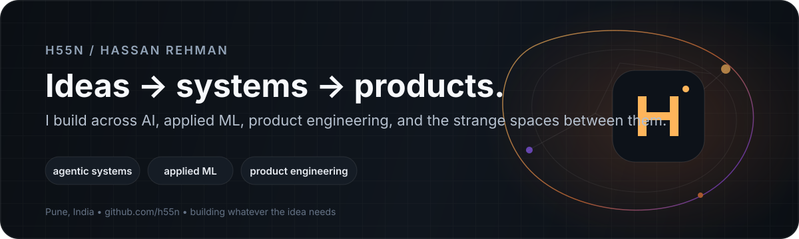

  

  
  
  
  

## Hey, I'm Hassan.

I like taking ideas that feel a little too ambitious at first and figuring out how to make them real.

I don't really work from one fixed label or stack. My projects have taken me through **agent memory, satellite-data ML, voice software, accessibility, agentic commerce, blockchain infrastructure, content systems, and browser-native multiplayer worlds**. The domain changes; the part I enjoy doesn't: understanding the problem, choosing the right architecture, and staying with it long enough for the difficult parts to show up.

I care about the engineering *around* AI as much as the model itself: **memory, state, permissions, safety, evaluation, latency, fallbacks, deployment, and product experience**. I also care a lot about how things look and feel. A technically impressive product that is confusing to use still feels unfinished to me.

  

## Selected work

<table>
<tr>
<td width="50%" valign="top">

### 🌆 [Together](https://github.com/h55n/together)
**Persistent multiplayer life simulator in the browser**

A large browser-native 3D world for couples and friends: households, homes, jobs, cooking, NPCs, authored stories, shared history, voice foundations, and persistent customization.

`Three.js` `WebGPU/WebGL2` `Rapier` `Socket.IO` `Supabase` `WebRTC`

**161 automated domain/integration tests** at handoff; current work is focused on browser performance, visual quality, and final production polish.

</td>
<td width="50%" valign="top">

### 🧠 [MNEME](https://github.com/h55n/MNEME)
**Sovereign memory infrastructure for AI agents**

Portable memory across model providers, semantic recall, MCP tools, temporal knowledge graphs, on-chain attestations, and cryptographic deletion proofs.

`Fastify` `PostgreSQL` `pgvector` `Redis` `Neo4j` `Solidity` `Monad` `MCP`

🏆 **Monad Blitz Pune V2 — Winner**  
Submitted to **OpenAI Build Week** and **ML Empowerment Build Challenge 2.0**.

</td>
</tr>
<tr>
<td width="50%" valign="top">

### 🏔️ [SlopeSense](https://github.com/h55n/slopesense)
**Landslide risk intelligence from satellite + weather data**

Fuses multiple earth-observation and weather sources into a probabilistic Failure Probability Index with forward forecasting, CAP alerts, retrospective validation, and a live GIS dashboard.

`Python` `FastAPI` `LightGBM` `PostgreSQL` `Celery` `Redis` `Next.js` `MapLibre`

**6/6 historic events flagged** in the documented retrospective set · **100+ tests** · sub-**120ms p95** API target in project measurements.

</td>
<td width="50%" valign="top">

### 🛒 [Small Merchant](https://github.com/h55n/small-merchant)
**Safety-gated agentic commerce for small merchants**

Turns messy merchant catalogs into searchable inventory for AI buyer agents while keeping payment authorization behind deterministic backend controls the model cannot bypass.

`FastAPI` `React` `TypeScript` `Embeddings` `Razorpay MCP` `WebSockets`

Built around a simple rule I care about: **probabilistic AI should not own deterministic safety boundaries.**

</td>
</tr>
<tr>
<td width="50%" valign="top">

### 🎙️ [Mike](https://github.com/h55n/mike)
**Global voice dictation for Windows**

A system-tray app that captures speech, transcribes it with Whisper, optionally cleans the result with an LLM, and types it into whichever app you're using.

`Python` `PyQt6` `Groq Whisper` `pynput` `PyInstaller`

Built around low-latency interaction rather than a chat interface.

</td>
<td width="50%" valign="top">

### 🎬 [Shooting OS](https://github.com/h55n/shooting-os)
**A focused operating system for short-form content**

Idea capture, hooks, scripting, planning, shooting view, knowledge grounding, research, series planning, and masterclass workflows in one single-owner product.

`Next.js` `TypeScript` `Supabase` `PWA` `Deterministic workflows`

AI is a provider layer here; product rules, approvals, and validation stay explicit.

</td>
</tr>
</table>

<b>More things I've built</b>

 

- 🌊 **[River Watch](https://github.com/h55n/river-watch)** — Sentinel-1/Sentinel-2 anomaly detection for human-reviewed sand-mining evidence.
- 💬 **[DeTalks](https://github.com/h55n/Detalks)** — safety-oriented mental-wellness architecture with separate conversational and monitoring roles.
- 🤖 **[fumii](https://github.com/h55n/fumii)** — AI companion work spanning episodic memory architecture and product/dashboard design.
- 🎤 **[Orator](https://github.com/h55n/orator)** — full-stack AI interview-preparation platform with Spring Boot, React, MySQL, practice mode, and assessment flows.
- 📰 **[EvrythingAI](https://github.com/h55n/EvrythingAI)** — automated AI/tech newsletter pipeline using Mistral, GitHub Actions, and Resend.
- 🏆 **[1ph](https://github.com/h55n/1ph)** — hackathon discovery platform with AI enrichment and structured extraction.
- 📱 **Lumi** *(private)* — multilingual, voice-first Android guidance assistant built around deterministic accessibility-tree matching before VLM fallback.

## Hackathons & recognition

<table>
<tr>
<td align="center"><b>🏆 Monad Blitz Pune V2</b> Winner MNEME</td>
<td align="center"><b>📱 iQOO Pune City Battle</b> Top 22 Finalist Lumi</td>
<td align="center"><b>⚡ i-Hack · IIT Bombay</b> Finalist E-Summit '25</td>
</tr>
<tr>
<td align="center"><b>✈️ FAR AWAY 2026</b> Round 2 / final offline qualifier Team FarFromHome</td>
<td align="center"><b>🌱 IEEE CodeBhoomi</b> Finalist Tech for Good</td>
<td align="center"><b>💡 Eureka! · IIT Bombay</b> Zonalist 2024</td>
</tr>
</table>

## Builder programs & ecosystems

  
  
  
  

  Also active around Pune builder communities including MetaMask Community Builder, Road to Devcon, Claude Code, Agent Builders, Qwen, and other developer meetups.

## The stack I reach for

  

  <code>LLM orchestration</code> · <code>RAG</code> · <code>MCP</code> · <code>pgvector</code> · <code>agent memory</code> · <code>voice / ASR</code> · <code>geospatial ML</code> · <code>WebSockets</code> · <code>Three.js</code> · <code>CI/CD</code>

## Experience

**Bluestock Fintech** · Software Development Engineer Intern · **Feb 2026 – Apr 2026**  
Full-stack product engineering across Next.js, authentication, CMS workflows, SEO, database work, and CI/CD.

**SalesMonk.ai** · Operations Management Intern · **May 2025 – Nov 2025**  
Dashboards, reporting pipelines, operational analysis, and process optimization.

**Jivika** · Marketing Intern · **Jun 2025 – Aug 2025**  
Campaign analysis, content performance, and creative production support.

## A little context

I learn fastest when I have an idea worth chasing. Sometimes that happens in a hackathon, sometimes in a long-running side project, and sometimes because I notice something that feels like it should exist but doesn't yet.

I'm comfortable learning outside my current stack if the idea needs it. That has pulled me into remote sensing, accessibility APIs, game systems, blockchain, voice, payments, safety-oriented AI, and product design. I would rather be known for the quality and range of the things I make than for fitting neatly into a single label.

<b>Education & certificates</b>

 

**B.E. Artificial Intelligence & Data Science** · Savitribai Phule Pune University · 2023–2027  
**3-year aggregate:** 9.67/10 · **Latest semester SGPA:** 10.00/10

Selected certificates include **Responsible AI: Applying AI Principles with Google Cloud**, **Data Analyst 101**, **Introduction to Generative AI**, **NLP & Text Mining**, and the **i-Hack Finalist Certificate of Excellence**.

## GitHub

  
  

---

  <b>If something here makes you want to talk about an idea, build, role, or collaboration, reach out.</b>

  <a href="https://linkedin.com/in/hassan-rehman-h55n">LinkedIn</a> ·
  <a href="mailto:hassan0rehman@gmail.com">Email</a> ·
  <a href="https://h55n.vercel.app">Portfolio</a>

