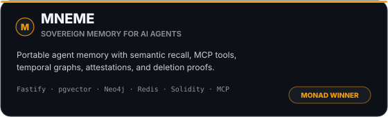
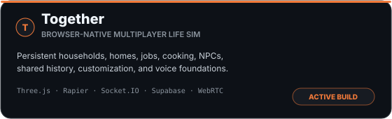
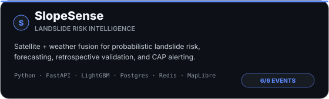
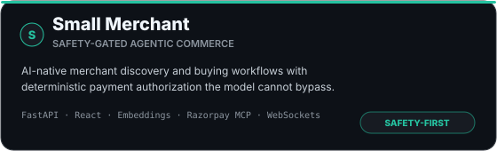

  

  
  
  
  

I like taking ideas that feel slightly too ambitious and making them real enough to **test, break, and improve**. Most of my work sits somewhere between AI systems, applied ML, full-stack engineering, and product design.

## What I build

- **Agentic systems & memory** — retrieval, MCP tools, persistent context, multi-provider workflows, and deterministic safety boundaries around probabilistic models.
- **Applied ML & data products** — satellite/weather fusion, anomaly detection, forecasting, validation, and production APIs around models.
- **Full-stack products** — real-time state, auth, persistence, WebSockets, offline flows, CI/CD, and the product logic that has to survive outside a demo.
- **Interaction-heavy software** — voice, accessibility, browser 3D, motion, and interfaces where how the system feels matters as much as what it computes.

## Currently building

<table align="center">
  <tr>
    <td align="center" width="190"><b><a href="https://github.com/h55n/together">Together</a></b> browser-native multiplayer world performance + world polish</td>
    <td align="center" width="190"><b><a href="https://github.com/h55n/shooting-os">Shooting OS</a></b> single-owner content system product iteration</td>
    <td align="center" width="190"><b><a href="https://github.com/h55n/slopesense">SlopeSense</a></b> geospatial risk intelligence model + alerting refinement</td>
  </tr>
</table>

## Flagship work

  
  

  
  

### The engineering behind them

- **[MNEME](https://github.com/h55n/MNEME)** explores what persistent AI-agent memory should look like when portability, semantic recall, MCP access, attestations, and deletion proofs are treated as infrastructure rather than prompt history.
- **[Together](https://github.com/h55n/together)** pushes browser-native 3D much further: a persistent multiplayer life simulator with households, homes, jobs, cooking, NPCs, customization, shared history, and voice foundations.
- **[SlopeSense](https://github.com/h55n/slopesense)** combines satellite and weather signals into a probabilistic landslide-risk pipeline with forecasting, retrospective validation, alert generation, and a production API surface.
- **[Small Merchant](https://github.com/h55n/small-merchant)** applies agents to commerce while keeping payment permission in deterministic backend code, so model behavior cannot bypass user authorization.

### More engineering

- **[Mike](https://github.com/h55n/mike)** — low-latency Windows voice dictation with Whisper, voice-activity detection, optional LLM cleanup, global hotkeys, and text injection into any app.
- **[Shooting OS](https://github.com/h55n/shooting-os)** — a focused content operating system for ideation, scripting, planning, research, shooting, offline access, and knowledge-grounded workflows.
- **[River Watch](https://github.com/h55n/river-watch)** — Sentinel-1/Sentinel-2 anomaly detection for river monitoring, deliberately designed to surface evidence for human review rather than overclaim conclusions.
- **[Orator](https://github.com/h55n/orator)** — Spring Boot + React interview-preparation system with structured question generation, timed practice, answer evaluation, auth, persistence, and session history.
- **[1ph](https://github.com/h55n/1ph)** — hackathon discovery and enrichment pipeline combining Next.js, Python automation, structured extraction, and AI-assisted normalization.
- **[EvrythingAI](https://github.com/h55n/EvrythingAI)** — automated AI/tech newsletter pipeline using RSS ingestion, Mistral-based curation/synthesis, GitHub Actions, and serverless delivery.

## Selected recognition

<table align="center">
  <tr>
    <td align="center" width="170"><b>Monad Blitz Pune V2</b> MNEME <b>WINNER</b></td>
    <td align="center" width="170"><b>i-Hack · IIT Bombay</b> E-Summit '25 <b>FINALIST</b></td>
    <td align="center" width="170"><b>iQOO Pune City Battle</b> Lumi <b>TOP 22 FINALIST</b></td>
  </tr>
  <tr>
    <td align="center" width="170"><b>FAR AWAY 2026</b> Team FarFromHome <b>ROUND 2 / FINAL OFFLINE</b></td>
    <td align="center" width="170"><b>IEEE CodeBhoomi</b> Tech for Good <b>FINALIST</b></td>
    <td align="center" width="170"><b>Eureka! · IIT Bombay</b> 2024 <b>ZONALIST</b></td>
  </tr>
</table>

## The stack I reach for

  

  <code>LLM systems</code> | <code>RAG</code> | <code>MCP</code> | <code>pgvector</code> | <code>agent memory</code> | <code>voice / ASR</code> | <code>geospatial ML</code> | <code>three.js</code> | <code>websockets</code> | <code>CI/CD</code>

## Visitor counter

  

