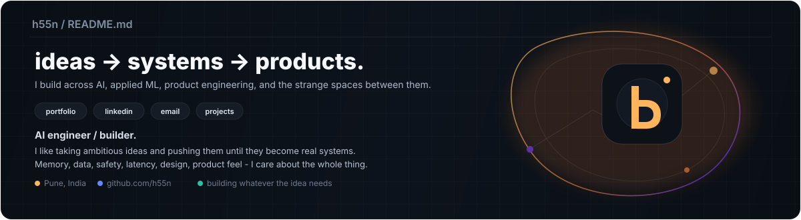

  

  
  
  
  

I build across **AI systems, applied ML, product engineering, and creative interfaces**. Most of my work starts from an idea that feels worth chasing, then turns into a real system with memory, data, safety, interaction design, and product thinking around it.

## Open source & engineering

- Built **[MNEME](https://github.com/h55n/MNEME)**, sovereign memory infrastructure for AI agents with MCP tools, temporal recall, and blockchain-backed attestations.
- Building **[Together](https://github.com/h55n/together)**, a persistent browser-native multiplayer life simulator with households, homes, jobs, cooking, NPCs, shared history, and voice foundations.
- Built **[SlopeSense](https://github.com/h55n/slopesense)**, a landslide-risk intelligence platform combining satellite + weather data into a probabilistic alerting system.
- Built **[Small Merchant](https://github.com/h55n/small-merchant)**, a safety-gated agentic commerce system where payment authorization stays under deterministic backend control.
- Built **[Mike](https://github.com/h55n/mike)**, a low-latency voice dictation tool for Windows using Whisper + optional LLM cleanup.
- Built **[Shooting OS](https://github.com/h55n/shooting-os)**, a focused operating system for content ideation, scripting, planning, shooting, and knowledge-grounded workflows.

## Selected recognition

<table align="center">
  <tr>
    <td align="center" width="170"><b>Monad Blitz Pune V2</b> MNEME <b>WINNER</b></td>
    <td align="center" width="170"><b>i-Hack · IIT Bombay</b> E-Summit '25 <b>FINALIST</b></td>
    <td align="center" width="170"><b>iQOO Pune City Battle</b> Lumi <b>TOP 22 FINALIST</b></td>
  </tr>
  <tr>
    <td align="center" width="170"><b>FAR AWAY 2026</b> Team FarFromHome <b>ROUND 2 / FINAL OFFLINE</b></td>
    <td align="center" width="170"><b>IEEE CodeBhoomi</b> Tech for Good <b>FINALIST</b></td>
    <td align="center" width="170"><b>Eureka! · IIT Bombay</b> 2024 <b>ZONALIST</b></td>
  </tr>
</table>

## The stack I reach for

  

  <code>LLM systems</code> | <code>RAG</code> | <code>MCP</code> | <code>pgvector</code> | <code>agent memory</code> | <code>voice / ASR</code> | <code>geospatial ML</code> | <code>three.js</code> | <code>websockets</code> | <code>CI/CD</code>

  
  
  
  
  
  
  
  
  
  
  
  

## Visitor counter

  

