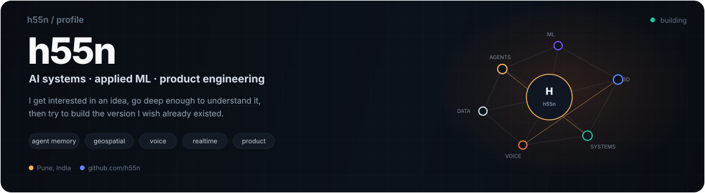

  

  
  
  
  

I like taking ideas that feel slightly too ambitious and making them real enough to **test, break, and improve**. Most of my work sits somewhere between AI systems, applied ML, full-stack engineering, and product design.

## Currently building

<table align="center">
  <tr>
    <td align="center" width="190"><b><a href="https://github.com/h55n/together">Together</a></b> browser-native multiplayer world performance + world polish</td>
    <td align="center" width="190"><b><a href="https://github.com/h55n/shooting-os">Shooting OS</a></b> single-owner content system product iteration</td>
    <td align="center" width="190"><b><a href="https://github.com/h55n/slopesense">SlopeSense</a></b> geospatial risk intelligence model + alerting refinement</td>
  </tr>
</table>

## Flagship work

  
  

  
  

  Also building: <a href="https://github.com/h55n/mike">Mike</a> · <a href="https://github.com/h55n/shooting-os">Shooting OS</a> · <a href="https://github.com/h55n/river-watch">River Watch</a> · <a href="https://github.com/h55n/orator">Orator</a> · <a href="https://github.com/h55n/1ph">1ph</a> · <a href="https://github.com/h55n/EvrythingAI">EvrythingAI</a>

## Selected recognition

<table align="center">
  <tr>
    <td align="center" width="170"><b>Monad Blitz Pune V2</b> MNEME <b>WINNER</b></td>
    <td align="center" width="170"><b>i-Hack · IIT Bombay</b> E-Summit '25 <b>FINALIST</b></td>
    <td align="center" width="170"><b>iQOO Pune City Battle</b> Lumi <b>TOP 22 FINALIST</b></td>
  </tr>
  <tr>
    <td align="center" width="170"><b>FAR AWAY 2026</b> Team FarFromHome <b>ROUND 2 / FINAL OFFLINE</b></td>
    <td align="center" width="170"><b>IEEE CodeBhoomi</b> Tech for Good <b>FINALIST</b></td>
    <td align="center" width="170"><b>Eureka! · IIT Bombay</b> 2024 <b>ZONALIST</b></td>
  </tr>
</table>

## The stack I reach for

  

  <code>LLM systems</code> | <code>RAG</code> | <code>MCP</code> | <code>pgvector</code> | <code>agent memory</code> | <code>voice / ASR</code> | <code>geospatial ML</code> | <code>three.js</code> | <code>websockets</code> | <code>CI/CD</code>

## Recent activity

  

## Visitor counter

  

